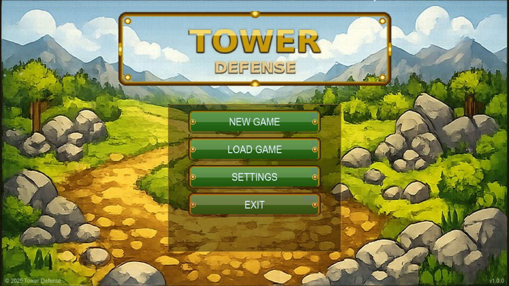
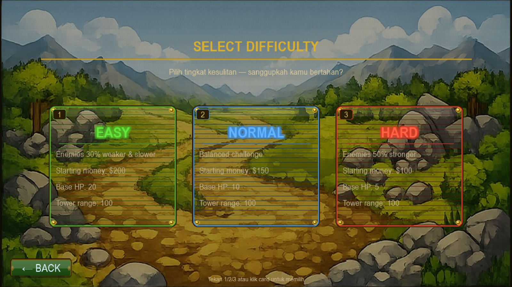
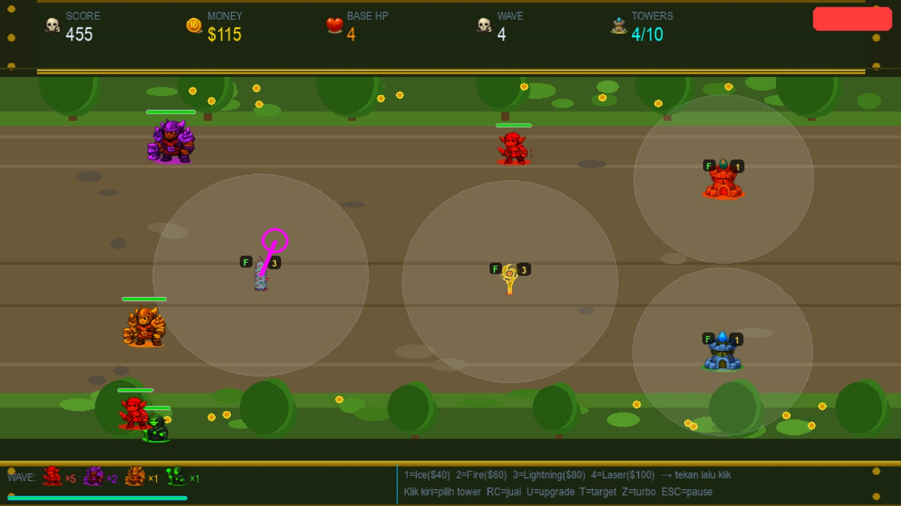
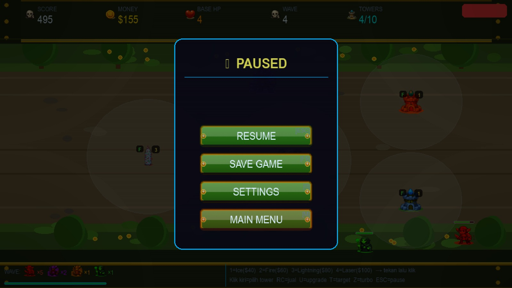
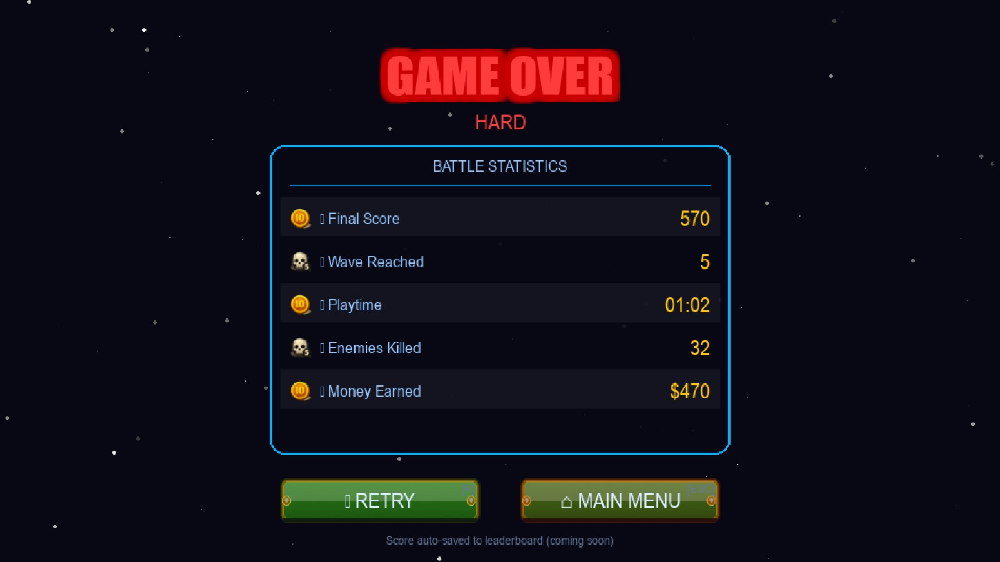

README.md

Deskripsi Project

Game Tower Defense adalah sebuah game strategi yang seru dan challenging. Konsepnya sederhana: kamu harus menempatkan menara pertahanan di sebuah peta untuk mengalahkan musuh-musuh yang terus berdatangan dalam gelombang demi gelombang.
Setiap musuh yang berhasil dikalahkan akan memberikan uang kepada pemain. Uang tersebut bisa digunakan untuk membeli tower baru atau upgrade tower yang sudah ada agar lebih kuat. Tujuan permainan adalah bertahan selama mungkin dan mengumpulkan score setinggi mungkin sebelum health base pemain habis.
Game ini dibuat menggunakan Python 3.13 dan Pygame 2.6 sebagai library utama. Project ini merupakan tugas akhir dari mata kuliah Object-Oriented Programming yang menerapkan konsep-konsep seperti inheritance, polymorphism, encapsulation, dan abstraction.
Dengan total 4790 baris kode dan 51 asset grafis, game ini merupakan sebuah project yang relatif besar dan kompleks. Game sudah dilengkapi dengan sistem audio, sistem save dan load, multiple menu screen, dan gameplay yang balance dan fun.

Anggota Kelompok

Project Tower Defense ini dikerjakan oleh sebuah tim yang terdiri dari beberapa anggota dengan pembagian tugas yang jelas:

Muhammad Daffa Firmansyah (25051204219) - Mengerjakan Gameplay dan Project Structure. Bertanggung jawab untuk membuat mekanik game utama seperti sistem tower, sistem enemy, sistem wave, dan mengorganisir struktur file project agar rapi dan mudah dimaintain.

Achmad Zidan Firmansyah (25051204142) - Mengerjakan UI dan Menu System. Membuat semua tampilan menu seperti main menu, difficulty selection, pause menu, settings menu, dan game over screen. Juga membuat in-game HUD yang menampilkan informasi penting.

M. Fahrizal Haqq (25051204099) - Mengerjakan Audio dan Sound Management. Menangani musik background untuk menu dan gameplay, membuat sound effects untuk berbagai action dalam game seperti tower shooting dan enemy death.

Muhammad Neo Enha Finardi (25051204143) - Mengerjakan Visual Effects dan Sprite System. Membuat semua grafis asset seperti sprite tower, sprite musuh, sprite bullet, UI elements, dan background.

Fitur Utama
Tower System

Game memiliki empat jenis tower dengan kemampuan dan karakteristik unik:
Ice Tower - Tower pertahanan dengan damage rendah tapi bisa memperlambat musuh. Cocok untuk mengontrol pergerakan musuh yang cepat. Cost 40 gold.
Fire Tower - Tower dengan damage sedang tapi bisa menyerang dua musuh sekaligus. Cocok untuk mengatasi musuh yang datang bergerombolan. Cost 60 gold.
Lightning Tower - Tower canggih yang bisa menyerang tiga musuh sekaligus dalam area tertentu. Damage per musuh rendah tapi total damage tinggi. Cost 80 gold.
Laser Tower - Tower dengan kecepatan tembak sangat tinggi dan damage per shot tinggi. Cocok untuk fokus pada musuh tertentu. Cost 100 gold.
Setiap tower bisa di-upgrade sampai level 3 untuk meningkatkan damage dan range. Pemain juga bisa menjual tower kapan saja dan mendapatkan 50% dari harga awal sebagai pengembalian dana.

Enemy System

Game memiliki delapan jenis musuh dengan karakteristik yang berbeda-beda:
FastEnemy - Musuh yang bergerak cepat dengan health rendah. Reward 10 gold.
TankEnemy - Musuh yang bergerak lambat tapi memiliki health tinggi. Reward 15 gold.
SlowEnemy - Musuh dengan kecepatan sedang dan health sedang. Reward 20 gold.
FlyingEnemy - Musuh yang terbang dan sulit untuk di-hit. Reward 25 gold.
BossEnemy - Boss yang muncul di wave tertentu dengan health dan damage sangat tinggi. Reward 100 gold.
ShieldEnemy - Musuh dengan armor shield yang bisa menyerap damage. Reward 30 gold.
HealingEnemy - Musuh yang bisa heal musuh-musuh di sekitarnya. Reward 35 gold.
SplitEnemy - Musuh yang bisa split menjadi beberapa musuh kecil saat dikalahkan. Reward 15 gold untuk parent, 5 gold per child.
Setiap musuh memiliki ability unik yang membuat strategi gameplay berbeda dan lebih challenging.

Game Features

Difficulty System - Ada tiga tingkat kesulitan (Easy, Normal, Hard) dengan adjustment di enemy stats dan economic.
Targeting Mode - Pemain bisa memilih cara tower menyerang: FIRST, LAST, STRONGEST, atau CLOSEST.
Wave System - Musuh datang dalam gelombang dengan preview yang menunjukkan musuh apa saja yang bakal datang.
Save and Load System - Pemain bisa save progress game dan lanjut bermain nanti.
Audio System - Musik background dan sound effects untuk semua action dalam game.
Pause and Turbo Mode - Pemain bisa pause kapan saja atau mempercepat waktu 2x dengan turbo mode.
Tower Limit - Pemain hanya bisa menempatkan maksimal 25 tower untuk optimize performa.

Cara Menjalankan Project
Prasyarat:

Python 3.13 atau lebih baru
pip (Python package manager)

Langkah Instalasi:

Step 1: Clone atau Download Repository
git clone https://github.com/daffafirmansyah12/tower-defense.git
cd tower-defense
Step 2: Install Dependencies
pip install pygame>=2.6.1
Step 3: Jalankan Game
python main.py
Game akan langsung terbuka. Pilih difficulty dan mulai bermain!

Kontrol Game
1, 2, 3, 4 - Menempatkan Ice, Fire, Lightning, atau Laser Tower
Klik Kiri Mouse - Memilih tower untuk diupgrade atau diatur
Klik Kanan Mouse - Menjual tower yang dipilih
U - Upgrade tower yang sedang dipilih
T - Mengubah targeting mode tower
SPACE - Pause atau resume permainan
Z - Aktivkan turbo mode (2x kecepatan)
ESC - Kembali ke menu atau pause

Penjelasan Implementasi OOP

Inheritance 

Inheritance diimplementasikan melalui class hierarchy yang jelas dan terstruktur.
GameObject adalah abstract base class yang mendefinisikan interface dasar untuk semua object di dalam game. Setiap object yang bisa di-draw dan di-move harus mewarisi dari class ini.
Tower adalah abstract class yang mewarisi dari GameObject dan mendefinisikan interface untuk semua jenis tower: IceTower, FireTower, LightningTower, LaserTower.
Begitu juga dengan Enemy yang merupakan abstract class dengan berbagai subclass: FastEnemy, TankEnemy, SlowEnemy, FlyingEnemy, BossEnemy, ShieldEnemy, HealingEnemy, SplitEnemy.
Setiap subclass mengoverride method-method seperti shoot() dan draw() sesuai dengan karakteristik unik mereka.

Polymorphism 

Polymorphism diterapkan melalui method overriding di setiap subclass.
Method draw() diimplementasikan berbeda di setiap tower dan enemy. Method move() di FlyingEnemy memiliki implementasi yang berbeda dengan enemy yang lain karena FlyingEnemy terbang dan memiliki hover effect.
Method get_reward() juga berbeda di setiap enemy karena masing-masing memberikan reward uang yang berbeda.

Encapsulation 

Encapsulation dilakukan dengan menggunakan private attributes seperti _x, _y, _health, _speed yang tidak bisa diakses langsung dari luar class.
Data hanya bisa diakses dan dimodifikasi melalui property methods dan getter/setter, sehingga melindungi integritas data dari modifikasi yang tidak diinginkan.

Abstraction 

Abstraction diterapkan melalui abstract classes yang mendefinisikan interface tanpa implementasi detail.
User hanya perlu tahu method publik yang tersedia seperti draw(), move(), shoot() tanpa perlu tahu detail implementasinya di setiap subclass.
Ini membuat code lebih clean, maintainable, dan mudah dipahami.

Screenshot Tampilan Program

Main Menu Screen

Menampilkan tombol New Game, Load Game, Settings, dan Quit.

Difficulty Selection Screen

Pemilihan Easy, Normal, atau Hard mode sebelum bermain.

Gameplay Screen

Peta dengan tower, musuh, dan HUD informasi game.

Pause Menu Screen

Menu dengan opsi Resume, Settings, Leaderboard, dan Main Menu.

Game Over Screen

Menampilkan final score, wave reached, playtime, dan opsi Retry/Menu.

Semua screen dirancang dengan UI yang clean, intuitif, dan mudah dipahami oleh pemain.

Repository GitHub: https://github.com/daffafirmansyah12/tower-defense

